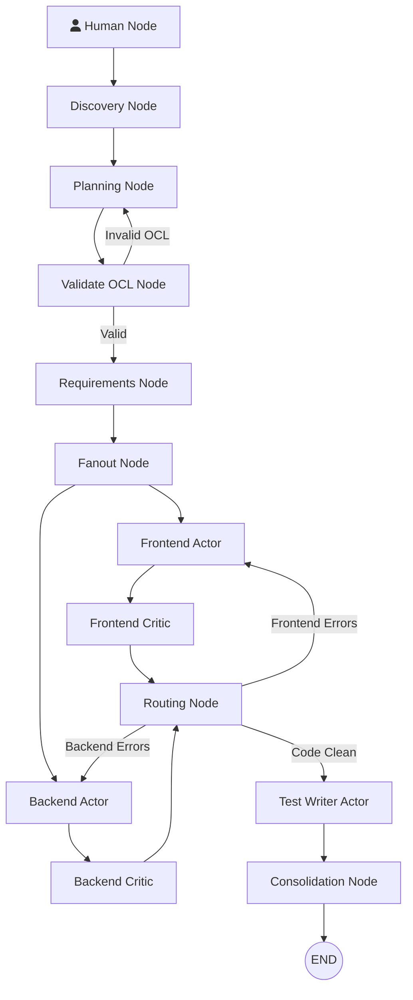

# GurdjDev Architecture
**Flusso Dati ed Ecosistema LangGraph**

GurdjDev basa la sua architettura su un **Directed Acyclic Graph (DAG)** deterministico, governato internamente da LangGraph. Tale architettura asseconda la metafora di Gurdjieff (separazione mente-corpo) imbrigliando la natura stocastica dei LLM all'interno di step rigidi di routing e Quality Gate rigorosi. 

Di seguito l'analisi tecnica del flusso del dato dall'input umano all'immagazzinamento cognitivo.

---

## 1. Il Nodo Decisionale (MIND)
Il flusso innesca la "Mente" tramite i nodi `human_node` e `discovery_node` per processare i macro requisiti utente. Ma il fulcro nevralgico dell'ingegneria software risiede nel **`planning_node`**.

### Socratic Planning: "Ask, Then Think"
Il `planning_node` riceve i documenti di design (Design Doc) per formalizzare il tutto in rigidi *Contratti JSON*. Anziché affidarsi alla generazione istantanea (zero-shot) e rischiare allucinazioni architetturali, il framework obbliga il LLM ad attivare una fase Socratic Reasoning:
1. **Ask Phase:** Il modello genera domande critiche dirette a se stesso: indaga sulle ambiguità del design, valuta la fattibilità dei vincoli richiesti (es. limiti OCL) e cerca inconsistenze di tipo architetturale.
2. **Think Phase:** Nello stesso spazio semantico (all'interno del blocco verboso `<socratic_reasoning>`), il modello formula e argomenta le risposte chiarendo le strutture dati e perfezionando la sua mappatura logica.
3. **Generazione:** Solo dopo questa validazione endogena, i token effettivi (quelli estratti ed elaborati dall'orchestratore) si materializzano nel JSON matematico. 

L'astrazione e il ragionamento anticipatorio abbattono radicalmente il tasso di ri-allocazione (retry_count) dovuto a errori di sintassi. Il JSON è poi sottoposto alla lente del **`validate_ocl_node`** che, mediante parsing deterministico (AST parser `Lark`), approva il rilascio verso gli *Actor*.

---

## 2. Parallelo ed Esecuzione ("Get-Shit-Done")
Una volta convalidato il contratto, il **`fanout_node`** dirama lo stato globale, sdoppiando asincronamente i thread di esecuzione verso il Frontend e il Backend.

### Gli "Actor" (La Carrozza)
Il `frontend_actor` e il `backend_actor` rappresentano l'essenza della carrozza esecutiva: muti e laboriosi. Non ricevono prompt estesi, e non hanno alcun canale di ritorno conversazionale verso il sistema. 
Tramite un approccio puro e crudo denominato *Get-Shit-Done* (GSD), prendono il JSON, serializzano le interfacce, generano sorgenti isolate su File System e comunicano esclusivamente tramite l'alterazione fisica dei file di output. 

---

## 3. Validazione e RAG Vettoriale (I "Critic")
Prima che l'esecuzione possa progredire, l'output sorgente è intercettato a tenaglia dai gate di controllo: il `frontend_critic` e il `backend_critic`. 

Questi nodi utilizzano eseguibili locali (SonarQube, ESLint, Flake8) per ricavare dump testuali o XML degli errori statici dal codice generato dagli *Actor*. 

### Vector RAG per il "Déjà vu" Sistemico
Qualora l'Actor sbagliasse, il sistema non attua un semplice *Retry*. I nodi Critic innescano la *Semantic Memory* tramite un sistema RAG (Retrieval-Augmented Generation) intelligente:
1. Interrogano il database **ChromaDB** attraverso l'integrazione di server vettoriali (SeaClip), ricercando *fingerprint* dell'errore sintattico o logico.
2. Recuperano l'eventuale "Ricordo" delle risoluzioni (es. "Import Error fix").
3. Impacchettano il feedback del linter *unito* a questo déjà vu contestuale, iniettando la soluzione nella successiva prompt per l'Actor tramite il `routing_node`.

---

## 4. Consolidamento dell'Esperienza (Swarm Mind)
Alla chiusura del ciclo Actor-Critic e superati i test, il grafo converge per il completamento del run verso il **`consolidation_node`**.

### Distillazione e LTP a fine Run
Questo è lo snodo cardine in cui il sistema manifesta la *Plasticità Sinaptica*. Il nodo scansiona il registro a breve termine (**Episodic Buffer** in SQLite) contenente i log crudi delle transazioni appena effettuate.
1. La "Swarm Mind" riepiloga le criticità affrontate ed estrae (distilla) "Modelli Concettuali di Soluzione", ignorando il rumore (noise) conversazionale e mantenendo puro abstract tecnico.
2. Gli schemi astratti diventano Documenti Vettoriali e inseriti nella **Semantic Memory (ChromaDB)**.
3. Se un pattern salvato in ChromaDB è stato recuperato in maniera vitale durante questo *run* (dal nodo Critic), il Consolidatore premia quel record aumentandone il "peso" e aggiornandone i timestamp (processo modellato sul **Long-Term Potentiation** biologico). Modelli vettoriali non utilzzati subiscono invece oblio (LTD).
