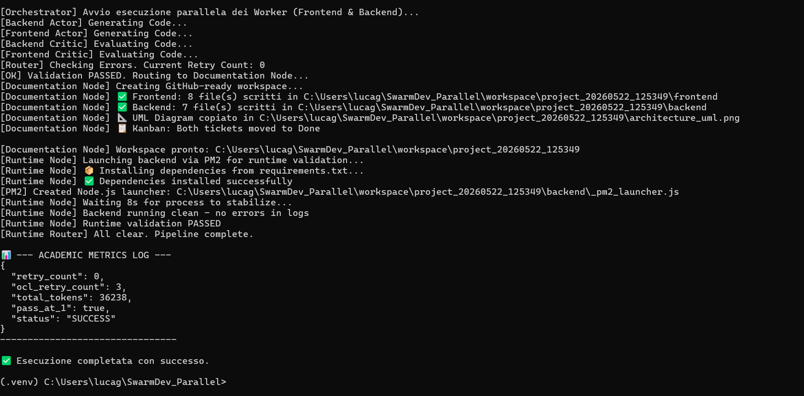

# SwarmDev Parallel: Deterministic Agentic Parallelization Framework



## 1. Contesto & Visione
**SwarmDev Parallel** è un framework sperimentale avanzato basato su un'architettura ad agenti paralleli. L'esigenza fondamentale alla base del progetto è risolvere il problema del "Chatter Smell"—le incomprensioni, le allucinazioni e i loop discorsivi inefficienti in linguaggio naturale che si verificano comunemente tra agenti AI durante lo sviluppo software. 

In questa fase di evoluzione ("Wave 2"), il progetto si è dotato di un sistema di orchestrazione a grafo (**LangGraph**) per gestire in modo centralizzato esecuzioni parallele (es. Frontend e Backend in simultanea), abbandonando infrastrutture a code asincrone in favore di un DAG deterministico.

## 2. Obiettivo: L'Approccio Actor-Critic e A2A-OCL
L'obiettivo primario è la **parallelizzazione agentica deterministica**. Forzando gli agenti a comunicare esclusivamente tramite contratti JSON rigidi e validati da vincoli matematici tramite **A2A-OCL** (Agent-to-Agent Object Constraint Language), il sistema garantisce un output prevedibile, formale e rigoroso.

Gli attori operano in un framework di **Quality Gate automatizzato** (Actor-Critic):
- **Actor (Worker)**: Genera il codice in totale isolamento (approccio *Get-Shit-Done*, zero output discorsivo).
- **Critic (Quality Gate)**: Valuta oggettivamente il codice tramite strumenti di analisi statica reale prima di confermare il nodo del grafo.

## 3. Ecosistema e Repository Integrate
Per raggiungere un livello di eccellenza architetturale, SwarmDev integra concetti, pattern e strumenti provenienti da architetture open-source e pattern avanzati di mercato:

- 🧠 **SuperPowers (per MIND)**: Utilizzato per instradare le *Guidelines* e il comportamento cognitivo dell'orchestratore, permettendo al nodo decisionale (MIND) di avere profonda consapevolezza del contesto e vincoli operativi.
- 📚 **CodeWiki**: Modulo integrato per la generazione, l'indicizzazione e la consultazione automatizzata della documentazione architetturale, garantendo che gli agenti abbiano sempre a disposizione le specifiche di progetto aggiornate.
- 🛠️ **CLIAnything**: Sfruttato per permettere un'interazione fluida, sicura e agnostica tra gli agenti esecutori e il sistema operativo sottostante (es. esecuzione dei comandi terminale senza allucinazioni).
- 🗂️ **LLMWiki Pattern & ChromaDB**: Il framework implementa il pattern *LLMWiki* appoggiandosi a **ChromaDB** come memoria vettoriale a lungo termine (RAG). Questo permette al sistema di "ricordare" le soluzioni a errori comuni e di fornire contesto storico (RAG memory) durante i loop di *conditional routing*.

## 4. Tecnologie Principali
- **LangGraph & LangChain**: Motore centrale per l'orchestrazione a grafo dei flussi di lavoro paralleli, routing condizionale e state management.
- **LiteLLM**: Routing flessibile verso molteplici provider LLM (OpenAI, Anthropic, Google Gemini, ecc.).
- **Lark (A2A-OCL)**: Parsing e validazione della grammatica custom dei contratti di interscambio.
- **Pydantic & SQLAlchemy**: Definizione formale, serializzazione e validazione dei payload.
- **Node.js & Repomix**: Utilizzati dal Quality Gate per generare uno *snapshot* XML ottimizzato dell'intero workspace, permettendo al modello di comprendere l'intera codebase minimizzando l'uso dei token.
- **Container & Analisi Statica (Docker, SeaClip, Sonar)**: 
  - **Docker**: Gestione isolata dei microservizi ancillari.
  - **SeaClip**: Server locale per l'indicizzazione semantica e recupero contestuale avanzato.
  - **Sonar (SonarQube) / Black / Flake8 / ESLint**: Pipeline rigorosa di code analysis integrata direttamente come *critic node* nel grafo.

## 5. Come Avviare il Sistema
L'architettura è centralizzata attorno allo script dell'orchestratore LangGraph.

### Prerequisiti
- **Python 3.10+**
- **Node.js & npm** (indispensabili per eseguire npx, repomix, eslint, opencode)
- **Docker** (per avviare i servizi di infrastruttura come ChromaDB, Sonar e SeaClip)

### Setup Iniziale
1. **Avvio Servizi Docker** (Sonar, SeaClip, ChromaDB):
   Avvia i container richiesti per i servizi ancillari nel tuo ambiente locale.

2. **Inizializzazione Ambiente Python**:
   ```powershell
   python -m venv .venv
   .\.venv\Scripts\activate
   pip install -r requirements.txt
   ```

3. **Configurazione Variabili d'Ambiente (`.env`)**:
   Crea una copia del file `.env.example`, rinominalo in `.env` e compila le variabili:
   - `OPENAI_API_KEY` (o chiavi per altri LLM)
   - `LLM_MODEL` (es. `gpt-4o`)

### Esecuzione
Per avviare l'engine di LangGraph e iniziare a processare i task paralleli in modalità deterministica:
```powershell
python graph_orchestrator.py
```

## 6. Metodo: Il Flusso "Get-Shit-Done" (GSD)
Il framework implementa un paradigma operativo guidato dall'efficienza e zero verbosità, orchestrato da LangGraph:
1. **Isolamento**: L'agente esecutivo (Worker/OpenCode) riceve prompt rigorosamente vincolati in XML ed esegue il task in un contesto "fresh" isolato, **privo di permessi per produrre output conversazionale**.
2. **Parallelismo Matematico**: Le esecuzioni di task complessi (es. creazione API e consumazione su UI) vengono splittate e gestite in rami paralleli all'interno del DAG.
3. **Quality Gate Autonomo**: Il codice prodotto converge nel validatore che sfrutta `repomix` per condensare la codebase in XML. Unitamente all'analisi di Sonar e ai Linter, il sistema produce un feedback matematico e oggettivo.
4. **Conditional Routing**: A fronte di un errore nel Gate, LangGraph instrada un *micro-loop* di correzione solo ed esclusivamente per l'attore fallimentare (max 3 tentativi). All'agente viene inoltrato solamente lo snapshot del codice fallato e l'output nudo del compilatore o linter.
