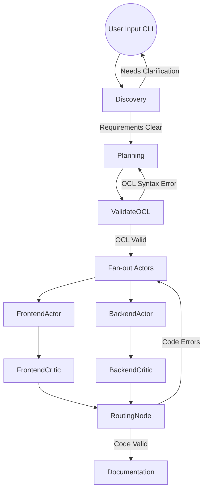

# Integrazione Nodo Mind in LangGraph Orchestrator

Questo documento descrive il piano architetturale per dismettere Parlant e integrare le responsabilità del nodo **Mind** (Requirements Elicitation, Planning, Contract Generation e OCL Validation) direttamente all'interno di `graph_orchestrator.py`.

## Obiettivo
Trasformare l'attuale workflow LangGraph (che si occupava solo della fase di Execution/Worker) in un grafo "End-to-End". Il nuovo grafo partirà da una richiesta utente testuale, eseguirà un ciclo maieutico per raccogliere i requisiti (Discovery), genererà l'architettura e i vincoli OCL, li validerà tramite un Micro-Loop interno, e infine scatenerà i Worker in parallelo.

> [!IMPORTANT]
> **User Review Required**
> Poiché LangGraph per default non offre un'interfaccia web (come faceva Parlant), la fase di *Discovery* dovrà avvenire tramite riga di comando (CLI). Il grafo si fermerà chiedendo input tramite terminale (`input()`) finché i requisiti non saranno chiari. È un compromesso accettabile?

## Open Questions
- **Gestione RabbitMQ**: Attualmente `graph_orchestrator.py` entrava in azione ascoltando `contract_queue`. Se inglobiamo la Mind nel grafo, possiamo far partire il grafo *direttamente* da terminale senza passare per RabbitMQ (generando i contratti in memoria e passandoli ai Worker successivi), oppure vuoi che il nodo Mind dentro LangGraph pubblichi comunque il contratto su RabbitMQ e poi si fermi, lasciando che un secondo script lo consumi? Consiglio di unire tutto in un singolo grafo per avere uno State condiviso e un terminale unico.
- **Prompt SUPERPOWERS**: Vuoi che io scriva un system prompt estremamente forte ("SUPERPOWERS") da iniettare nel nodo Discovery per guidare l'LLM nell'estrazione chirurgica dei requisiti senza divagare? O hai già un prompt che vuoi fornirmi?

## Proposed Changes

### 1. Estensione dello State in `graph_orchestrator.py`
Aggiorneremo `OrchestratorState` per supportare la memoria conversazionale e i nuovi artefatti:
- `chat_history`: (lista di messaggi) per mantenere il contesto durante l'interazione con l'utente.
- `design_doc`: (str) il file DESIGN.md generato.
- `ocl_errors`: (str) per contenere gli errori sintattici durante il parsing OCL.

### 2. Nuovi Nodi LangGraph (La Mente)

#### [NEW NODE] `discovery_node`
- **Scopo:** Sostituisce la chat di Parlant. Interagisce con l'utente per chiarire API, Modelli Dati ed Edge Cases.
- **Logica:** Utilizza l'interazione umana nel loop. Finché l'LLM ha domande o necessita di conferme, il grafo chiederà l'input all'utente. Quando i requisiti sono considerati pronti e approvati, il nodo produce la documentazione preliminare.

#### [NEW NODE] `planning_node`
- **Scopo:** Genera l'architettura e il Contratto JSON.
- **Logica:** Se riceve un `ocl_errors` dallo State (quindi proviene da un fallimento del validatore), sa che deve correggere la stringa OCL e riprovare. Output: un Contratto JSON completo e aggiornato.

#### [NEW NODE] `validate_ocl_node`
- **Scopo:** Implementa il Micro-Loop OCL in modo matematico.
- **Logica:** Importa `A2AOCLValidator`. Estrae i vincoli dal Contratto JSON.
  - Se ci sono errori sintattici: popola `ocl_errors` e il router del grafo rimpalla automaticamente l'esecuzione al `planning_node` senza interazione utente.
  - Se è valido: pulisce `ocl_errors` e passa lo State agli Actor.

### 3. Modifica del Routing e Struttura del Grafo

#### [MODIFY] `graph_orchestrator.py`
- Riorganizzazione dell'entrypoint: invece di un listener in loop su RabbitMQ (`start_consumer()`), avremo una funzione interattiva che lancia il DAG partendo dallo User.

## Verification Plan

### Manual Verification
1. Eseguiremo il nuovo `python graph_orchestrator.py`.
2. Il terminale ci accoglierà chiedendoci cosa vogliamo sviluppare.
3. Forniremo un task di base. Il sistema ci porrà domande tecniche in stile "SUPERPOWERS".
4. Verificheremo dai log che il sistema, durante il Planning, valuti le stringhe OCL e, in caso di errori sintattici (ad es. dimentica la keyword `inv:`), ritorni al Planning node correggendosi da solo in modo invisibile e rapidissimo.
5. Verificheremo che una volta pronti, partano i Worker paralleli e vengano creati i file.
