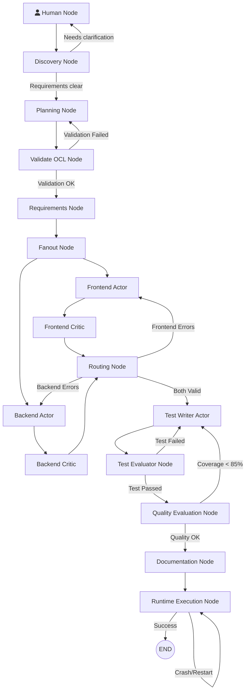

# SwarmDev Parallel: Graph Architecture Walkthrough

This walkthrough details the architecture of the **SwarmDev Parallel** framework, specifically focusing on the Directed Acyclic Graph (DAG) powered by LangGraph.

## 1. Graph Architecture

The core of SwarmDev Parallel is a deterministic state machine that orchestrates the inter-agent collaboration, from requirements gathering to execution and validation. 

Below is the visual representation of the DAG:

> [!TIP]
> **Deterministic Flow**: The LangGraph engine strictly enforces that no node can bypass its Quality Gate.

## 2. Phase Breakdown

### Phase 1: Discovery & Planning
The flow starts with the **Human Node** feeding the initial idea. The **Discovery Node** enters a maieutic loop with the user until the domain model and APIs are perfectly clear. Once clear, the **Planning Node** breaks the project into logical waves and formalizes the JSON Contract. The **Validate OCL Node** ensures all constraints mathematically hold before any code is written.

### Phase 2: Parallel Generation (Fanout)
The **Requirements Node** packages the validated contract and triggers the **Fanout Node**, which splits the state into two parallel branches. The **Frontend Actor** and **Backend Actor** work simultaneously in completely isolated contexts (*Get-Shit-Done* approach, zero conversation).

### Phase 3: Actor-Critic & Micro-Loops
Each actor's output immediately flows into its respective critic: **Frontend Critic** and **Backend Critic**. These nodes utilize `Repomix` and real static analysis tools (Sonar, ESLint, Flake8). 
The **Routing Node** acts as a synchronization barrier: if any critic found an error, the specific actor is routed back into a *micro-loop* to fix its own code, receiving only the compiler's output and the XML snapshot.

### Phase 4: Testing & Quality Assurance
Once generation is verified, the **Test Writer Actor** generates unit and integration tests. The **Test Evaluator Node** runs a sandbox (e.g., pytest) and the **Quality Evaluation Node** ensures code coverage is above strict thresholds (e.g., 85%). If coverage is insufficient, the graph routes back to writing more tests.

### Phase 5: Documentation & Runtime
Finally, the **Documentation Node** updates `CodeWiki` and the architecture documents. The **Runtime Execution Node** attempts to boot the actual application. If runtime crashes are detected, it can auto-recover by looping back or terminating successfully.

## 3. Key Takeaways
- **No Chatter Smell**: By confining LLMs to rigid DAG nodes, conversational loops are completely eliminated.
- **High Efficiency**: Frontend and Backend are generated synchronously, halving the apparent generation time.
- **A2A-OCL Driven**: The contracts defined in Phase 1 dictate the absolute truth for Phase 2 and 3.
